<!DOCTYPE html>
<html>
    <head>
        <meta charset="UTF-8">
        <link rel="stylesheet" type="text/css" href="templates/readme.css" />
    </head>
    <body>
        <h1>수채화 - 의료분야 수어 챗봇 서비스</h1>
        

            <h3>제 5기 KDT 해커톤 우수상(고용노동부 장관상) 수상</h3>
            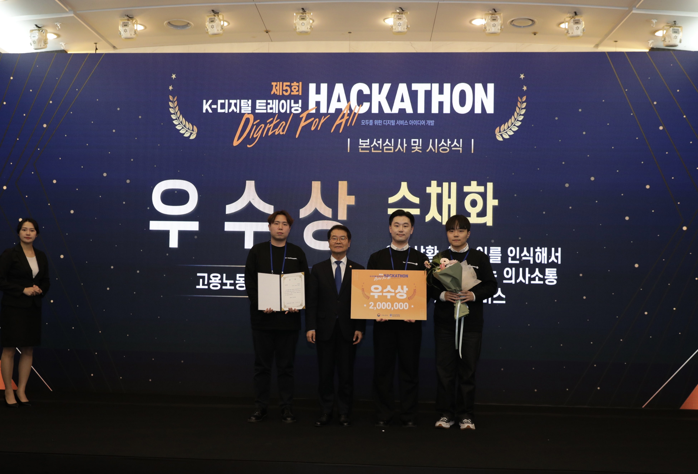
        

        <h2>프로젝트 개요</h2>
        <table class="summary">
            <tr>
              <th>기간</th>
              <td>2023.08.14 ~ 2023.11.28 (총 107일)</td>
            </tr>
            <tr>
              <th>인원구성</th>
              <td><a href="https://github.com/Leo-Moooon">문성우</a> 
                  <a href="https://github.com/okteam13">박태휘</a> 
                  <a href="https://github.com/xxonyuk">채성혁</a></td>
            </tr>
            <tr>
              <th>프로젝트 목표</th>
              <td>수어 인식이 가능한 챗봇 서비스의 개발을 통한 청각장애인의 의료격차 해소</td>
            </tr>
            <tr>
              <th>프로젝트 내용</th>
              <td>▪ 수어인식 모델 개발 간 GRB 비디오 입력과 keypoint 입력 시의 성능 비교 
                  ▪ 챗봇 개발 간 RAG(Retrieval-augmented generation, 검색 증강 생성) 기술의 적용을 통한 답변의 정확성, 신뢰성 향상</td>
            </tr>
            <tr>
              <th>개발환경   (클라우드)</th>
              <td>  <code>CLOUD</code> Google Colab Pro+ 
                    <code>OS</code>  Linux(Ubuntu 18.04.6 LTS)   
                    <code>CPU</code> Intel Xeon   <code>GPU</code> V100 / A100   
                    <code>RAM</code> 40GB</td>
            </tr>
            <tr>
              <th>사용 언어 및   기술 스택</th>
              <td>  <code>Language</code>   
                                            
                                              
                    <code>Editor</code>     
                                            
                                            
                                              
                    <code>Modeling</code>   
                                            
                                            
                                              
                    <code>CV</code>         
                                            
                                            
                                              
                    <code>NLP</code>        
                                            
                                              
                    <code>DB</code>         
                                              
                    <code>Web</code>        
                                            
                                            
                                            
                                            
                                             
                    <code>Logging</code>    
                                              
                    <code>Version Control</code>        
                                            
                                             
              </td>
            </tr>
        </table>
        

            <h2>목차 및 바로가기</h2>
            <ol class="project-ul" start="1">
                <li>서비스</li>
                <ul class="serve-ul">
                    <li><a href="#testing">활용 예시(시연 영상)</a></li>
                    <li><a href="#service-ui">서비스 UI</a></li>
                    <li><a href="#service-architecture">서비스 구조도</a></li>
                </ul>
                 
                <li>데이터</li>
                <ul>
                    <li><a href="#data-section">데이터 수집</a></li>
                </ul>
                 
                <li>모델링</li>
                <ul class="modeling-ul">
                    <li><a href="#SSLR-V1">수어인식 모델: SSLR V1</a></li>
                    <li><a href="#SSLR-V2">수어인식 모델: SSLR V2</a></li>
                        <ul class="SSLRV2-ul">
                            <li><a href="#strategy01">성능 개선 전략 01: Keypoint 추출</a></li>
                            <li><a href="#strategy02">성능 개선 전략 02: Customized Normalization</a></li>
                            <li><a href="#ablation-study">Ablation Study: 성능개선 전략 적용 여부에 따른 SSLR 성능 변화</a></li>
                        </ul>
                </ul>
                 
                <li>챗봇</li>                
                <ul class="chatbot-ul">
                    <li><a href="#FAQ-section">FAQ</a></li>
                    <li><a href="#query-embedding-section">질문 가공: ChatGPT API, One-Shot Prompting을 이용한 문장 변환</a></li>
                    <li><a href="#return-answer-section">답변 반환: Langchain을 통한 ChatGPT 기반의 RAG(Retrieval-Augmented Generation) 구현</a></li>
                </ul>
                 
                 
                <li>추후 개선 방향</li>
            </ol>
        

         
        

            <h2>1. 서비스</h2>
            <h3 id="testing">활용 예시</h3>
            
             
             
            <h3 id="service-ui">서비스 UI</h3>
            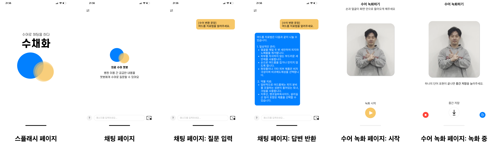
            <ul>
                <li>Flask를 이용한 웹서비스 구현</li>
                <li>Socket.IO를 통한 클라이언트-서버 실시간 통신</li>
            </ul>
             
             
            <h3 id="service-architecture">서비스 구조도</h3>
            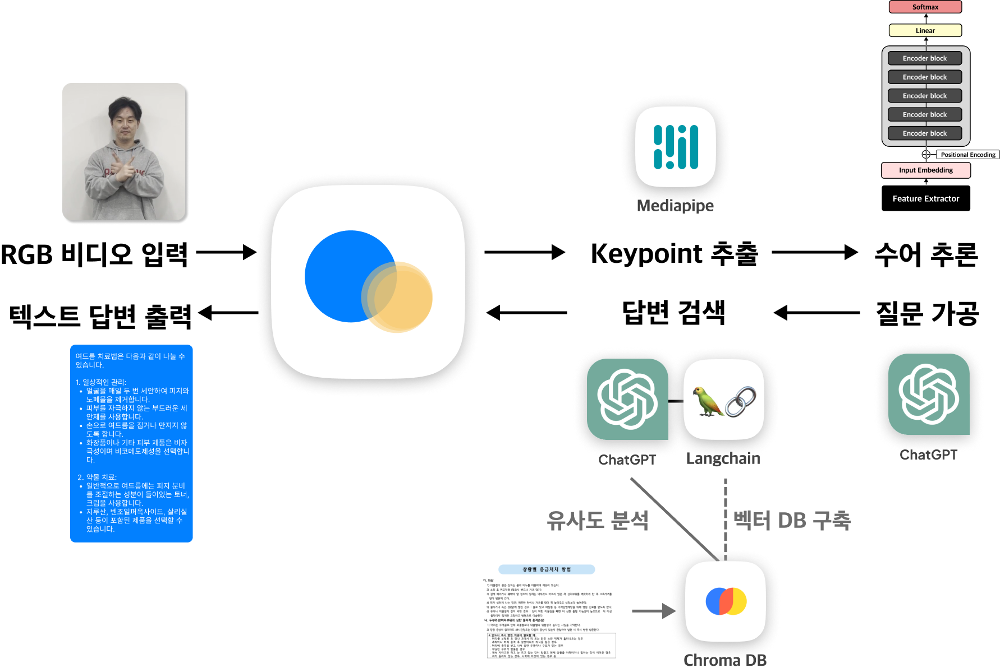
             
             
        

         
        

            <h2>2. 데이터</h2>
            <h3 id="data-section">데이터 수집</h3>
            
AI Hub - "수어 영상" 데이터셋에서 단어 영상 및 라벨 데이터 취득.

            <ul>
                <li>EDA를 통해 전체 의료 용어 5,485건, 일상어 12,317건을 선별.</li>
                <li>데이터셋에서 제시하는 기준에 맞춰 Train 및 Validation 데이터 구분.</li>
                <li>제공된 Train과 Validation 데이터의 유사성이 높다고 판단하여, Test 데이터는 별도로 촬영하여 소량 수집하였음.</li>
            </ul>
        

         
        

            <h2>3. 모델링</h2>
            <h3 id="SSLR-V1">수어인식 모델: SSLR V1 (Soochaehwa Sign Language Recognizer V1)</h3>
            <table class="sslrv1-table">
                <tr>
                    <td width="300">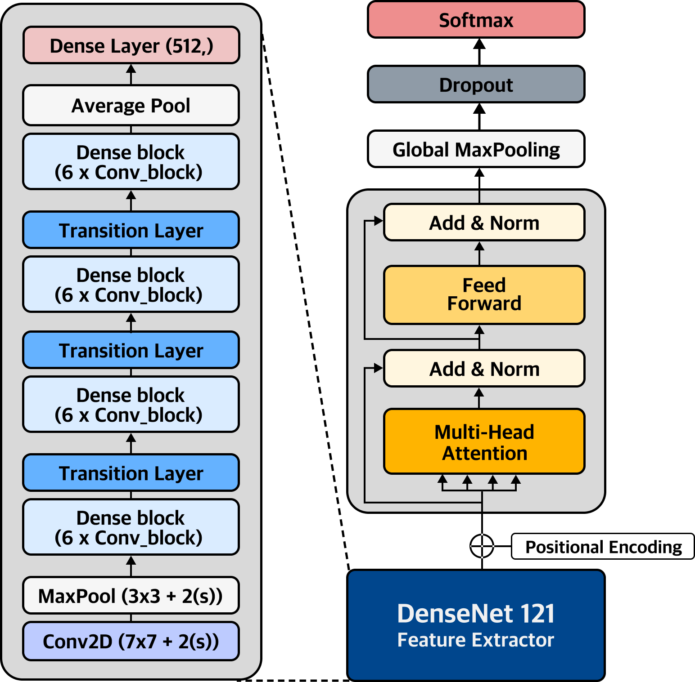</td>
                    <td>
                        <ol>
                            <li>접근 가설</li>
                            <ul>
                                <li>수어는 연속된 동작이므로, 행동을 인식하고 분류하는 문제로 파악</li>
                                <li>RGB 비디오를 학습하여 각 동작에 대한 일반화 기대</li>
                            </ul>
                             
                            <li>아키텍쳐 특징</li>
                            <ul>
                                <li>사전학습된 DenseNet-121을 통해 각 프레임 내 특징 추출</li>
                                <li>Transformer-Encoder 구조로, 프레임 간 전후맥락을 고려한 학습 의도</li>
                            </ul>
                             
                            <li>참고 자료</li>
                            <ul>
                                <li><em>"Beyond Short Snippets: Deep Networks for Video Classification"(Ng et al., 2015)</em></li>
                                <li><em>"Attention Is All You Need" (Vaswani, A., et al., 2017)</em></li>
                            </ul>
                        </ol>
                    </td>
                </tr>
            </table>
             
            <h3>SSLR V1 학습 및 예측 결과</h3>
            <table>
                <tr>
                    <th>Accuracy</th>
                    <th>예측 결과</th>
                </tr>
                <tr>
                    <td>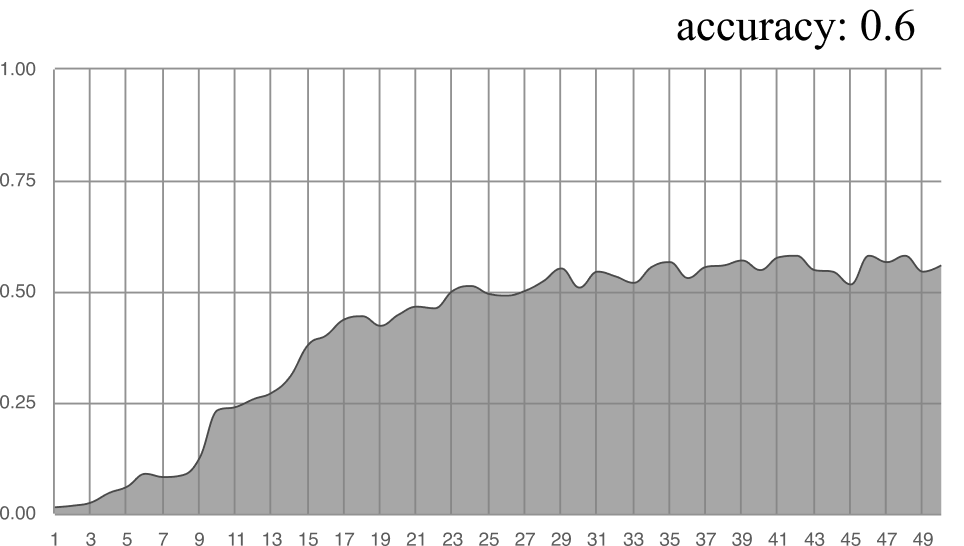</td>
                    <td>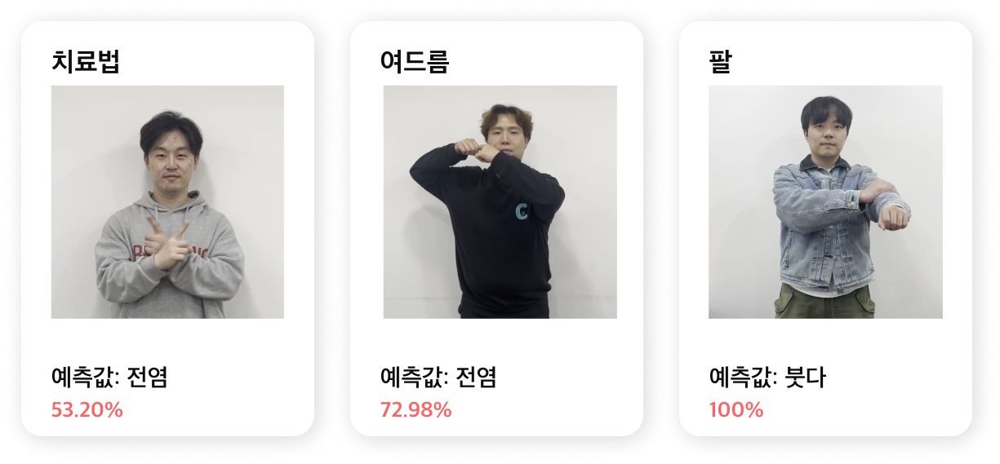</td>
                </tr>
            </table>
            <h4>원인 분석</h4>
            <li>부족한 특징 추출로 인한 underfit 현상.</li>
            <li>모델이 학습데이터에 과하게 편향되어 실제 데이터를 제대로 맞추지 못하는 것으로 추정.</li>
             
            <h3 id="SSLR-V2">수어인식 모델: SSLR V2 (Soochaehwa Sign Language Recognizer V2)</h3>
            <table class="sslrv2-table">
                <tr>
                    <td width="300">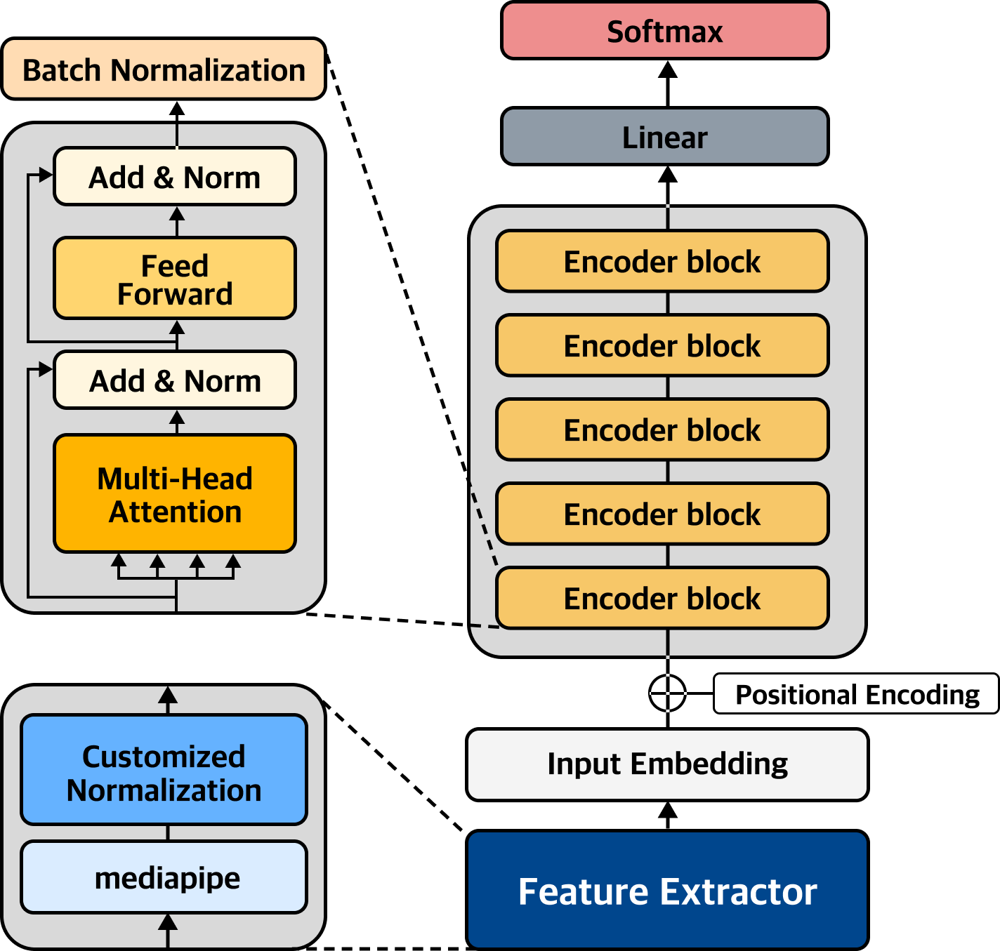</td>                    <td>
                        <ol>
                            <li>접근 가설</li>
                            <ul>
                                <li>많은 데이터를 필요로 하는 Vision Transformer의 특징이 
                                    SSLR V1에서 과소적합(underfit)의 원인이 되었을 것으로 추정</li>
                                <li>신체 키포인트 추출을 통해 특징 추출 극대화</li>
                            </ul>
                             
                            <li>아키텍쳐 특징</li>
                            <ul>
                                <li><strong>특징 추출기 변경</strong>
                                    <ol>
                                        <li>RGB 비디오에서 신체 Keypoint 데이터 추출</li>
                                        <li>별도의 정규화 (Customized Normalization) 진행</li>
                                    </ol>
                                </li>
                                <li>BERT의 구조를 차용하되, 각 block 사이에 Batch Normalization 레이어 추가</li>
                            </ul>
                             
                            <li>참고 자료</li>
                            <ul>
                                <li><em>"Preprocessing for Keypoint-Based Sign Language Translation without Glosses"(Kim & Baek, 2023)</em></li>
                                <li><em>"BERT: Pre-training of Deep Bidirectional Transformers for Language Understanding." Devlin, J., et al. (2019).</em></li>
                            </ul>
                        </ol>
                    </td>
                </tr>
            </table>
            <h3 id="strategy01">성능개선 전략 01: Keypoint 추출</h3>
            
Mediapipe 라이브러리를 이용한 신체 Keypoint 추출. 그 후 데이터프레임으로 정규화

            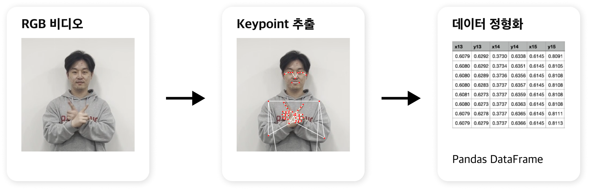
             
            <h3 id="strategy02">성능개선 전략 02: Customized Normalization</h3>
            
하단의 레퍼런스에서 제안한 Customized Normalization 기법을 보유 데이터셋에 적합하게 일부 수정하여 코드 구현 및 적용.

            <table>
                <tr>
                    <th>STEP01: 하반신 제거 및 지역 분할</th>
                    <th>STEP02: 각 지역별 거리 정규화</th>
                </tr>
                <tr>
                    <td>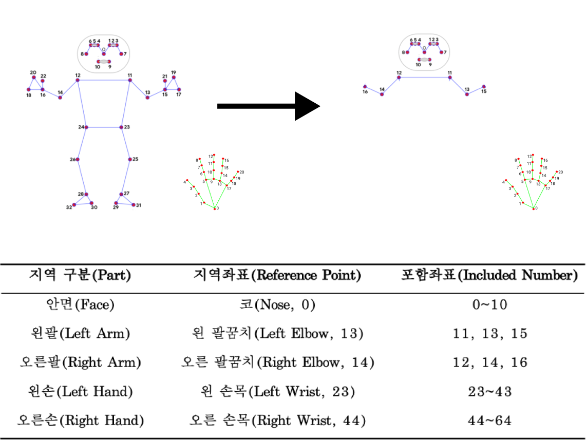</td>
                    <td>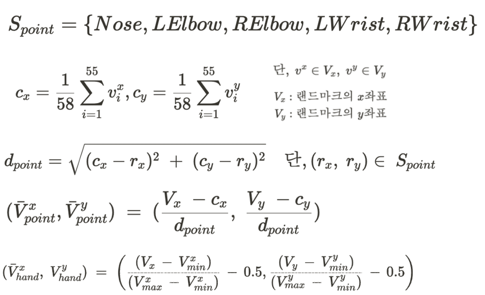</td>
                </tr>
            </table>
            <li>레퍼런스: <em>"Preprocessing for Keypoint-Based Sign Language Translation without Glosses"(Kim & Baek, 2023)</em></li>
             
            <h3 id="ablation-study">Ablation Study: 성능개선 전략 적용 여부에 따른 SSLR 성능 변화</h3>
            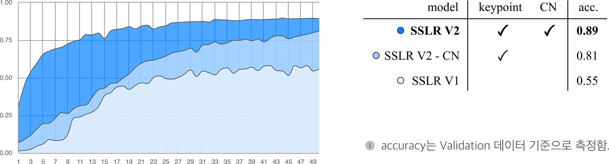
            
Input data를 Keypoint로 변경하고, Customized-Normalization까지 적용하였을 때 가장 높은 성능이 나왔음.

             
            <h3 id="SSLRV2-result">SSLR V2 예측 결과</h3>
            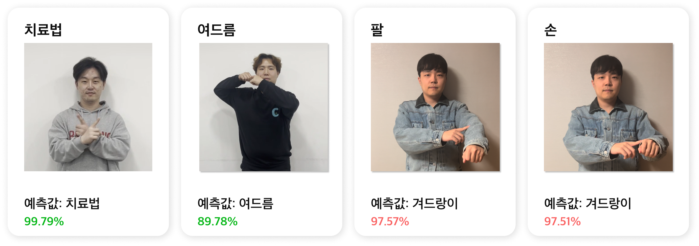
            <li>SSLR V1에 더 일반화 된 성능</li>
            <li>하지만 유사한 동작에 대해서는 잘 맞추지 못하는 문제가 남아있음. (예시: 팔, 손)</li>
        

         
        

            <h2>4. RAG(Retrieval-Augmemted Generation) 챗봇</h2>
            

                RAG(Retrieval-Augmented Generation, 검색 증강 생성)는 LLM이 학습한 데이터가 아닌, 제공받는 외부 정보 내에서 검색한 정보를 기반으로 답변을 생성하는 기술입니다. 
                본 프로젝트에서는 Langchain을 이용해 ChatGPT가 입력받은 질문의 답변을 외부 정보로 입력한 PDF 자료 내에서 검색하여 반환하도록 설계하였습니다.
            

             
            <h3 id="FAQ-section">FAQ</h3>
            
<strong>Q1.</strong> ChatGPT 등의 성능 좋은 기존 생성형 모델을 쓰지 않는 이유는?

            <blockquote>
                ChatGPT 등의 여러 LLM이 다양한 도메인에서 높은 성능을 보이면서 큰 이슈가 된 것은 사실입니다. 
                하지만 해당 LLM이 챗봇에게 요구하는 정보를 모두 가지고 있는지 확신할 수 없으며, 잘못된 정보를 제공하는 Hallucination 현상은 정보의 신뢰성을 중요시하는 병원에게 치명적이라 판단하여 그대로 쓰는 것은 선택지에서 배제하였습니다. 
            </blockquote>
            
<strong>Q2.</strong> 정보의 신뢰성이 중요하다면 Rule-based 챗봇을 고려하지는 않았는지?

            <blockquote>
                입력받은 질문에 대해 반환할 답변을 미리 정하는 방법은 앞서 언급한 Hallucination 문제를 원천적으로 방지할 수 있습니다. 
                하지만 챗봇의 성능이 질문-답변 패턴의 가짓수 및 정교함에 비례한다는 점에서 지속적인 인적 자원의 부담으로 직결이 됩니다. 
                따라서 이를 해소하는 RAG(검색 증강 생성)를 적용하였습니다.
            </blockquote>
             
            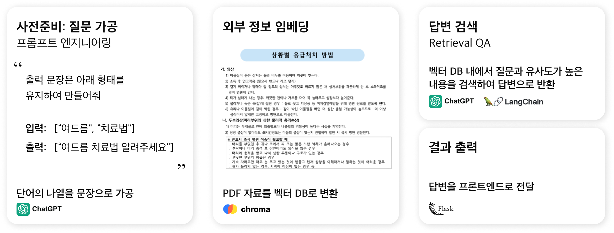
            <h3 id="query-embedding-section">사전준비: 질문 가공</h3>
            
 하나의 질문을 나타내는 일련의 단어 영상은 SSLR을 통해 예측 단어의 리스트로 변환됩니다. 
                이를 문장으로 변환하기 위해 단기적인 방법으로써 ChatGPT에 One-Shot Prompting을 적용하였습니다.
                더 나은 성능을 위해 여러 예시를 제공하는 Few-Shot Prompting 적용도 가능하며, 장기적으로는 수어 문장 번역 모델을 개발 및 확보하여 본 과정을 생략할 수 있습니다.
            

            <ol>
                <li>수어(텍스트) 입력 
                     <pre><code>predict_result = ['여드름', '치료법']</code></pre>
                </li>
                 
                <li> One-Shot Prompting 예시 구문 
                    <pre><code> f'''
      1. 아래 리스트에 제시 단어를 조합하여 의문형 문장을 만든다.
      2. 조합 문장은 최적의 문장 1개를 출력한다.
      3. 출력 문장은 아래 형태를 유지하여 만든다.
      (예시: 제시 단어(사용자 제시 단어): ['여드름', '치료법'],
            의문형 문장(반환 내용): '여드름 치료법 알려주세요.'
 '''
                    </code></pre>
                </li>
            </ol>
             
            <h3 id="return-answer-section">RAG를 위한 벡터 데이터베이스 구축 및 답변 반환</h3>
            <ul>
                <li>벡터 데이터베이스 구축  
                    <ul>
                        <li>HuggingFace의 "intfloat/multilingual-e5-large"를 통해 PDF 내 텍스트 임베딩</li>
                        <li>Chroma를 통한 임베딩 된 텍스트의 벡터 데이터베이스화</li>
                    </ul>
                     
                <li>답변 반환</li>
                    <ul>
                        <li>LLM으로 ChatGPT 채택</li>
                        <li>Langchain의 RetrievalQA 메소드를 통해 입력받은 질문과 유사도가 높은 내용을 벡터 DB 내에서 검색하여 답변 생성</li>
                    </ul>
            </ul>
        

    </body>
</html>
